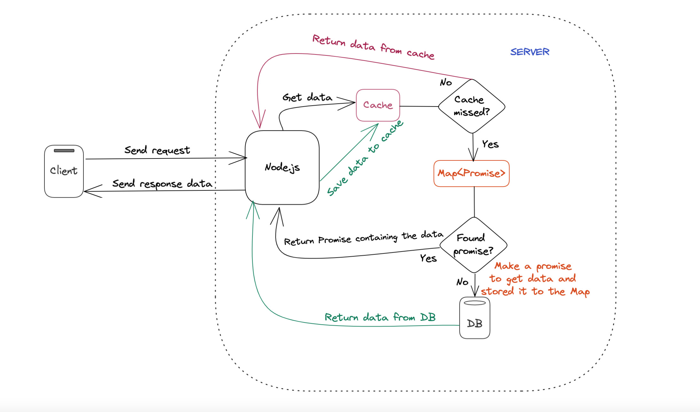

<!--  -->

<!-- [](https://github.com/node-cache/node-cache/actions?query=workflow%3A%22Node.js+CI%22+branch%3A%22master%22)

[](https://www.npmjs.com/package/node-cache)
[](https://www.npmjs.com/package/node-cache)
[](https://github.com/node-cache/node-cache/issues)
[](https://coveralls.io/github/node-cache/node-cache) -->

# Simple and fast NodeJS internal caching with high performance.

A simple caching module that has `getOrSet` methods that allow you make a BE application with high performance
Keys can have a timeout (`ttl`) after which they expire and are deleted from the cache.


## HOW IT WORKS?




# Install

```bash
npm install node-cache-aside --save
```

# Examples:

## getOrSet:

```js
import { cacheAside } from "node-cache-aside"
const key = 'cacheKey'
const callback = async () => {
    const data = await getDataFromDB() // your function to get data from database
    return data
}
const TTL = 300 // seconds
const result = await cacheAside.getOrSet(key, callback, TTL)
```

### Function parameter

- `key`: *(type: string, require: true)* The cache key that you want to get or set the data in
- `callback`: *(type: async function, require: true)* The callback function to get the data if it doesn't exist on the cache
- `TTL`: *(type: number, require: false, default: null) The standard TTL as a number in seconds for every generated cache element. If it isn't specific, the cache will exist forever


## nodeCache
To use feature same as `node-cache` package, you can follow example below: 
```js
import { cacheAside } from "node-cache-aside"
const nodeCache = cacheAside.nodeCache()
const data = nodeCache.get('cache_key')
```
## Breaking changes


## Compatibility

This package supports all node versions >= 8


## Dependency Package
- `node-cache`: [https://github.com/node-cache/node-cache](https://github.com/node-cache/node-cache)


## Release History
|Version|Date|Description|
|:--:|:--:|:--|
|1.0.0|2022-11-10|First version|


# The MIT License (MIT)

Copyright © 2022 STDIO and the node-cache-aside maintainers

Permission is hereby granted, free of charge, to any person obtaining
a copy of this software and associated documentation files (the
'Software'), to deal in the Software without restriction, including
without limitation the rights to use, copy, modify, merge, publish,
distribute, sublicense, and/or sell copies of the Software, and to
permit persons to whom the Software is furnished to do so, subject to
the following conditions:

The above copyright notice and this permission notice shall be
included in all copies or substantial portions of the Software.

THE SOFTWARE IS PROVIDED 'AS IS', WITHOUT WARRANTY OF ANY KIND,
EXPRESS OR IMPLIED, INCLUDING BUT NOT LIMITED TO THE WARRANTIES OF
MERCHANTABILITY, FITNESS FOR A PARTICULAR PURPOSE AND NONINFRINGEMENT.
IN NO EVENT SHALL THE AUTHORS OR COPYRIGHT HOLDERS BE LIABLE FOR ANY
CLAIM, DAMAGES OR OTHER LIABILITY, WHETHER IN AN ACTION OF CONTRACT,
TORT OR OTHERWISE, ARISING FROM, OUT OF OR IN CONNECTION WITH THE
SOFTWARE OR THE USE OR OTHER DEALINGS IN THE SOFTWARE.